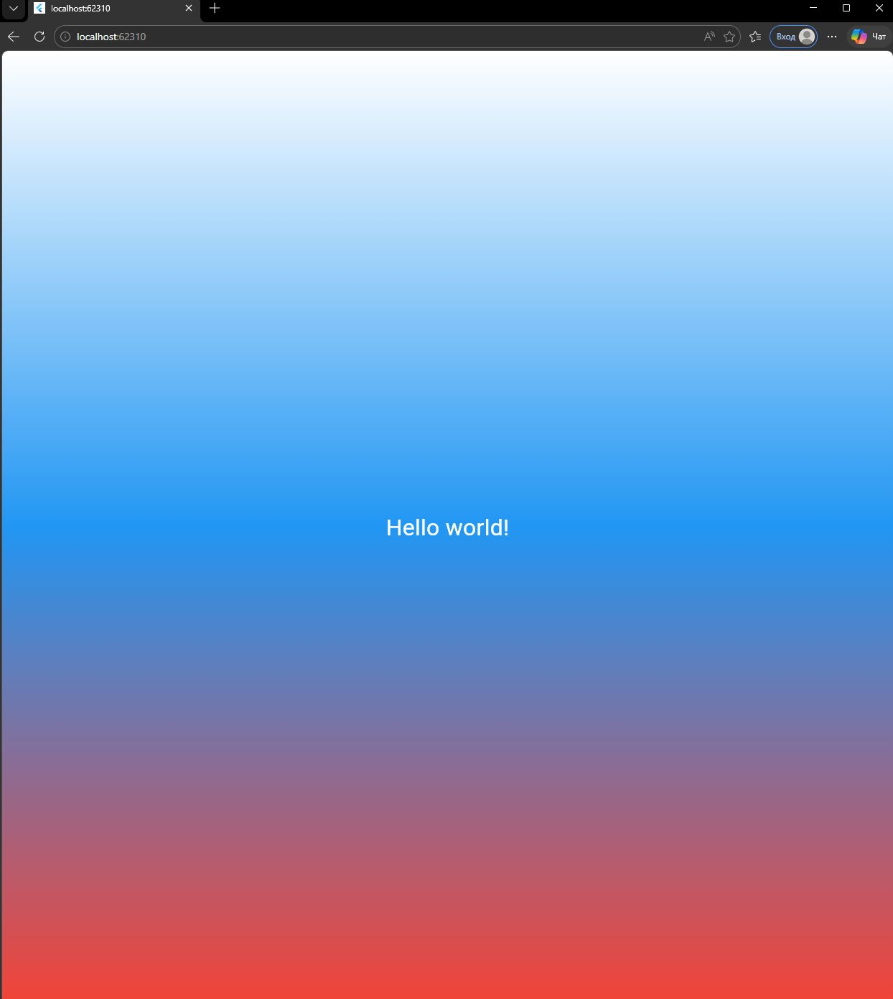

# Flutter_Lab2

Первое Flutter-приложение, созданное в рамках лабораторной работы №2. Приложение отображает текст "Hello world!" с градиентным фоном и стилизованным текстом.

## Автор

- **Имя:** Богданов Иван и Шумила Диана
- **Группа:** ИСП-233

## Стек и версии

- **Flutter:** 3.41.2
- **Dart:** 3.11.0
- **Платформа:** Web (Edge/Chrome)
- **IDE:** VS Code

## Скриншот приложения



## Как запустить

```bash
# 1. Клонировать репозиторий
git clone <URL вашего репозитория>

# 2. Перейти в папку проекта
cd first_flutter_app

# 3. Установить зависимости
flutter pub get

# 4. Запустить приложение в браузере
flutter run -d edge
```
### Что изучили
Создание и запуск Flutter-проекта

Структура виджетов и дерево виджетов

Работа с основными виджетами: MaterialApp, Scaffold, Container, Center, Text

Стилизация текста через TextStyle

Оформление фона через BoxDecoration и LinearGradient

Hot Reload и работа с DevTools